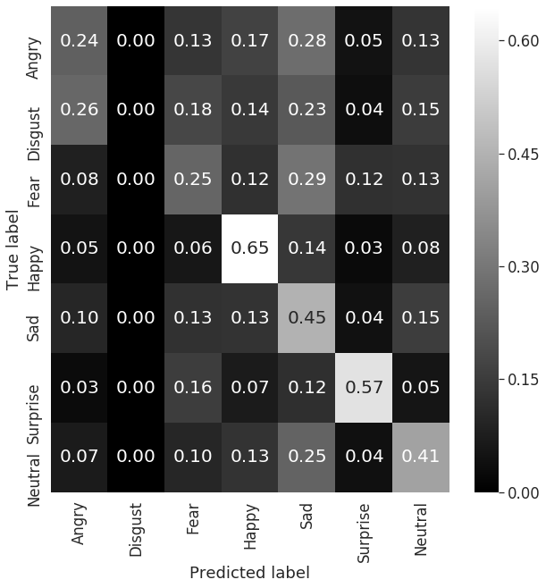

<!--
*** Thanks for checking out this README Template. If you have a suggestion that would
*** make this better, please fork the psychopathology-fer-assistant and create a pull request or simply open
*** an issue with the tag "enhancement".
*** Thanks again! Now go create something AMAZING! :D
***
***
***
*** To avoid retyping too much info. Do a search and replace for the following:
*** RodolfoFerro, psychopathology-fer-assistant, twitter_handle, rodolfoferroperez@gmail.com
-->


<!-- PROJECT LOGO -->
<br />
<p align="center">
  <a href="https://github.com/RodolfoFerro/psychopathology-fer-assistant">
    
  </a>
  <br />

  <!-- Badges -->
  
  
  
  
  <br />
  <a href="https://www.linkedin.com/in/rodolfoferro/">
    
  </a>
  <a href="https://twitter.com/FerroRodolfo/">
    
  </a>

  <h3 align="center">Psychopathology Assistant</h3>
  <p align="center">
    Because mental health matters.
    <br />
    <a href="https://github.com/RodolfoFerro/psychopathology-fer-assistant"><strong>View the demo »</strong></a>
    <br />
  </p>
</p>


<!-- TABLE OF CONTENTS -->
## Table of Contents

* [About the Project](#about-the-project)
  * [Motivation](#motivation)
  * [Built With](#built-with)
* [Getting Started](#getting-started)
  * [Prerequisites](#prerequisites)
  * [Installation](#installation)
* [Usage](#usage)
  * [Data Exploration](#data-exploration)
  * [Model Training](#model-training)
  * [Web Application](#web-application)
  * [Model Serving](#model-serving)
* [Roadmap](#roadmap)
* [License](#license)
* [Contact](#contact)
* [Acknowledgements](#acknowledgements)


<!-- ABOUT THE PROJECT -->
## About The Project

[![P-FER Assistant][product-screenshot]](https://github.com/RodolfoFerro/psychopathology-fer-assistant)

An intelligent assistant to track psychopathology patients responses during face-to-face and remote sessions.

### Motivation

Mental health is important. I will be adding a more detailed paragraph here, with references and everything.

### Built With

With a lot of love 💖, motivation to help others 💪🏼 and [Python](https://www.python.org/) 🐍, using:

* [Flask](https://www.palletsprojects.com/p/flask/) 
* [MongoDB](https://www.mongodb.com/) 
* [Tensorflow 2.0](https://www.tensorflow.org/) 
* [Google Colab](https://colab.research.google.com/)  (with its wonderful GPUs)
* Model quantization with `tf.lite` for serving ⚙️
* A [Raspberry Pi](https://www.raspberrypi.org/) Model 3B+ 


<!-- GETTING STARTED -->
## Getting Started

To get a local copy up and running follow these simple steps.

### Prerequisites

This is an example of how to list things you need to use the software and how to install them.
* Virtual environment
```bash
<some-code>
```

### Installation

1. Clone the `psychopathology-fer-assistant` repo:
```bash
git clone https://github.com/RodolfoFerro/psychopathology-fer-assistant.git
```
2. Install requirements:
```bash
pip install -r requirements.txt
```


<!-- USAGE EXAMPLES -->
## Usage

### Data Exploration


### Model Training

After doing some research in the state of the art for Facial Expression Recognition tasks, I found that in "[Extended deep neural network for facial emotion recognition (EDNN)](https://www.sciencedirect.com/science/article/abs/pii/S016786551930008X)" by Deepak Kumar Jaina, Pourya Shamsolmoalib, and Paramjit Sehdev (Elsevier – Pattern Recognition Letters 2019) the proposed model turns out to achieve better results in classification tasks for Facial Expression Recognition, and by the architecture metrics this network turns out to be a more lightweight model compared with others (such as LeNet or Mobile Net).

As part of the project development **I have implemented from zero the proposed model using Tensorflow 2.0**. For training I used the previously mentioned dataset from the "[Challenges in Representation Learning: Facial Expression Recognition Challenge](https://www.kaggle.com/c/challenges-in-representation-learning-facial-expression-recognition-challenge/data)" by Kaggle. So far the model was trained **for only 10 epochs using a batch size of 132**. The training history can be seen in the following graphs:

<center>


</center>

About the results, **the model has achieved with only 10 epochs an accuracy value of 0.4428 on the validation dataset**, with a result that could be part of the top 40 values in the [challenge leaderboard](https://www.kaggle.com/c/challenges-in-representation-learning-facial-expression-recognition-challenge/leaderboard). We can get a general idea of the model performance in the confussion matrix:

<center>

</center>

The trained model architecture and quantized model with tflite (for the deployment in the Raspberry Pi) can be found in the [model folder](https://github.com/RodolfoFerro/psychopathology-fer-assistant/tree/master/model). Finally, if you want to re-train the model and verify the results by your own, or only if you have the curiosity to understand deeper the whole process of building and training the model with detail, checkout the notebook found in the same folder, or directly click on the following button to open it directly into Google Colab.

<a href="https://colab.research.google.com/github/RodolfoFerro/psychopathology-fer-assistant/blob/master/model/Convolutional_model.ipynb" target="_blank">
  
</a>


### Web Application


### Model Serving


<!-- ROADMAP -->
## Roadmap

- What will come next?


<!-- CONTRIBUTING -->
<!-- ## Contributing

Contributions are what make the open source community such an amazing place to be learn, inspire, and create. Any contributions you make are **greatly appreciated**.

1. Fork the Project
2. Create your Feature Branch (`git checkout -b feature/AmazingFeature`)
3. Commit your Changes (`git commit -m 'Add some AmazingFeature'`)
4. Push to the Branch (`git push origin feature/AmazingFeature`)
5. Open a Pull Request -->


<!-- LICENSE -->
## License

Distributed under a GPLv3 License. See `LICENSE` for more information.


<!-- CONTACT -->
## Contact

Rodolfo Ferro - [@FerroRodolfo](https://twitter.com/FerroRodolfo) - rodolfoferroperez@gmail.com

Project Link: [https://github.com/RodolfoFerro/psychopathology-fer-assistant](https://github.com/RodolfoFerro/psychopathology-fer-assistant)


<!-- ACKNOWLEDGEMENTS -->
## Acknowledgements

* Icons made by [Smashicons](https://www.flaticon.com/authors/smashicons) from [www.flaticon.com](https://www.flaticon.com/)
* Icons made by [Flat Icons](https://www.flaticon.com/authors/flat-icons) from [www.flaticon.com](https://www.flaticon.com/)
* Icons made by [Becris](https://www.flaticon.com/authors/becris) from [www.flaticon.com](https://www.flaticon.com/)


<!-- MARKDOWN LINKS & IMAGES -->
<!-- https://www.markdownguide.org/basic-syntax/#reference-style-links -->
[product-screenshot]: assets/screenshot.png
