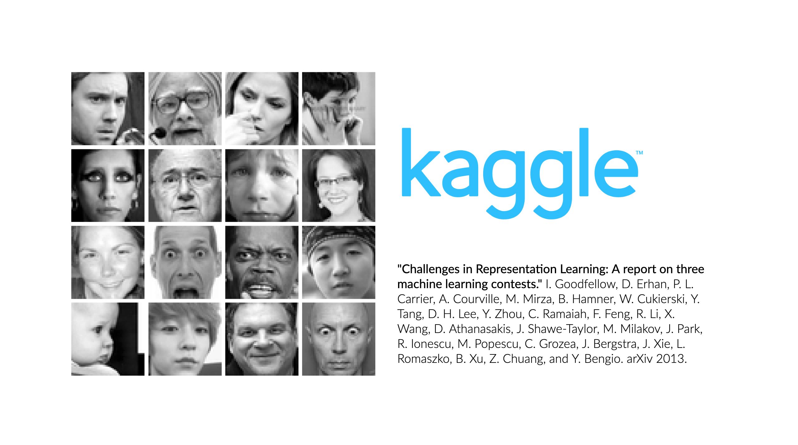
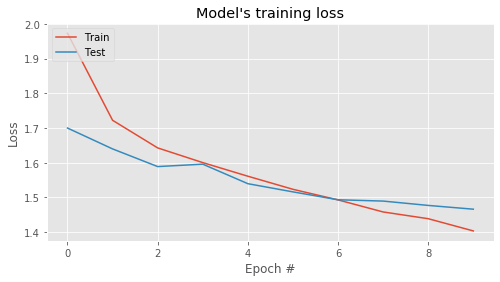
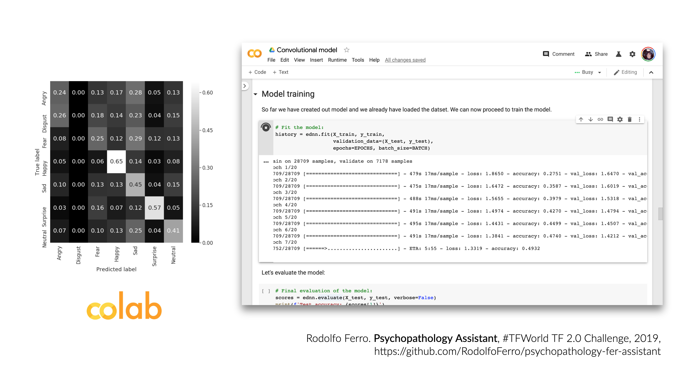
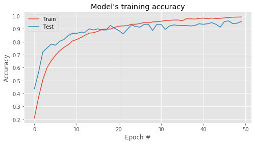
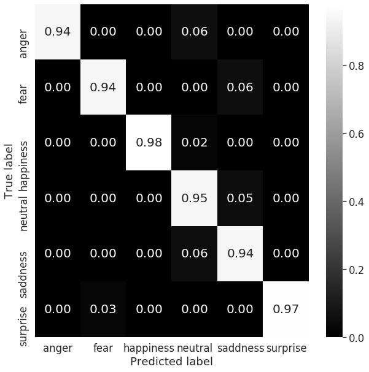
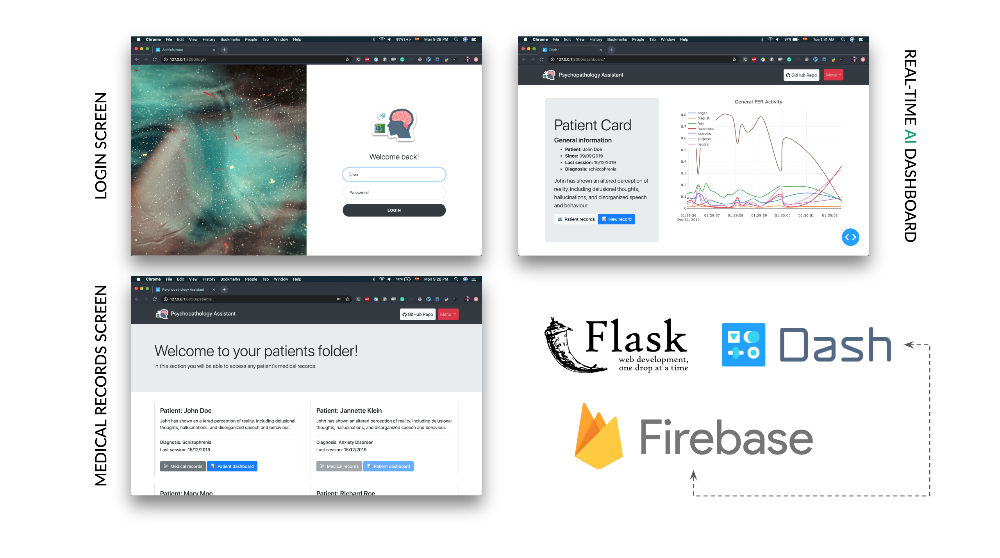
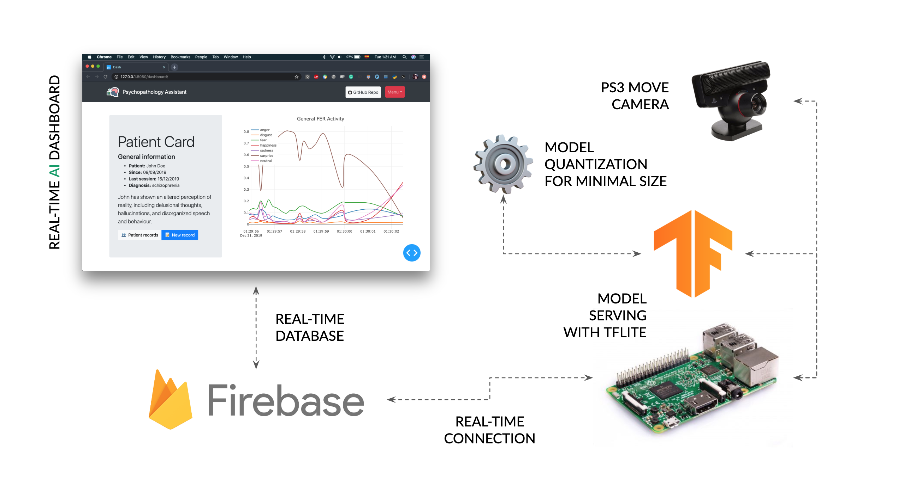

<!--
*** Thanks for checking out this README Template. If you have a suggestion that would
*** make this better, please fork the psychopathology-fer-assistant and create a pull request or simply open
*** an issue with the tag "enhancement".
*** Thanks again! Now go create something AMAZING! :D
***
***
***
*** To avoid retyping too much info. Do a search and replace for the following:
*** RodolfoFerro, psychopathology-fer-assistant, twitter_handle, rodolfoferroperez@gmail.com
-->


<!-- PROJECT LOGO -->
<br />
<p align="center">
  <a href="https://github.com/RodolfoFerro/psychopathology-fer-assistant">
    
  </a>
  <br />

  <!-- Badges -->
  
  
  
  
  <br />
  <a href="https://www.linkedin.com/in/rodolfoferro/">
    
  </a>
  <a href="https://twitter.com/FerroRodolfo/">
    
  </a>

  <h3 align="center">Psychopathology Assistant</h3>
  <p align="center">
    Because mental health matters.
    <br />
    <a href="https://youtu.be/Y1DfFQbkmYM"><strong>View the demo »</strong></a>
    <br />
  </p>
</p>


<!-- TABLE OF CONTENTS -->
## Table of Contents

* [About the Project](#about-the-project)
  * [Motivation](#motivation)
  * [Built With](#built-with)
* [Getting Started](#getting-started)
  * [Prerequisites](#prerequisites)
  * [Installation](#installation)
* [Usage](#usage)
  * [Data Exploration](#data-exploration)
  * [Model Training](#model-training)
  * [Web Application](#web-application)
  * [Model Serving](#model-serving)
* [Roadmap](#roadmap)
* [License](#license)
* [Contact](#contact)
* [Acknowledgements](#acknowledgements)


<!-- ABOUT THE PROJECT -->
## About The Project

[](https://www.youtube.com/watch?v=Y1DfFQbkmYM)

An intelligent assistant platform to track psychopathology patients responses during face-to-face and remote sessions.

This platform makes use of a machine learning algorithm capable of tracking and detecting facial expressions to identify associated emotions through a camera. This allows the corresponding medical staff to take care of their patients by creating medical records supported by the artificial intelligent system, so they can follow-up the corresponding treatments.

### Motivation

Some facts:

- Anxiety disorders, Mood disorders, Schizophrenia and psychotic disorders, Dementia...
- Over 50 percent of all people who die by suicide suffer from major depression
- Most of these disorders are treated primarily through medications and psychotherapy
- As you may have had, **I have had depression** and I can only ask to my self "what are we doing to help others avoid or decrease their suffering?"

##### Mental health is important.

And as I have mentioned, **most of these disorders are treated primarily through medications and psychotherapy**, and tracking the emotional responses of the patients during psychoterapy sessions may result important as this reveals progress on their treatment. This is why I am trying to help with this AI based platform.


### Built With

With a lot of love 💖, motivation to help others 💪🏼 and [Python](https://www.python.org/) 🐍, using:

* [Tensorflow 2.0](https://www.tensorflow.org/) 
* [Google Colab](https://colab.research.google.com/)  (with its wonderful GPUs)
* Model quantization with `tf.lite` for serving ⚙️
* A [Raspberry Pi](https://www.raspberrypi.org/) Model 3B+ 
* A real-time [Flask](https://www.palletsprojects.com/p/flask/) and [Dash](https://plot.ly/dash/) integration (along with [Dash Bootstrap Components](https://dash-bootstrap-components.opensource.faculty.ai/))  + 
* A real-time database, of course, from [Firebase](https://firebase.google.com/) 
* The [Kaggle API](https://github.com/Kaggle/kaggle-api) to get the dataset 

<!-- GETTING STARTED -->
## Getting Started

To get a local copy up and running follow these simple steps.

### Prerequisites

This is an example of how to list things you need to use the software and how to install them. For this particular section I will suppose that you already have git installed on your system.

For a general everview of the Raspberry Pi setup, you can check out my blog tutorial on [how to setup your Raspberry Pi Model B as Google Colab (Feb '19) to work with Tensorflow, Keras and OpenCV](https://rodolfoferro.xyz/Setup-your-Raspberry-Pi-as-Google-Colab/), **as those are the steps that we will follow**. In any case, this specific setup can be seen in the corresponding [rpi](https://github.com/RodolfoFerro/psychopathology-fer-assistant/tree/master/rpi) folder.

### Installation

1. Clone the `psychopathology-fer-assistant` repo:
```bash
git clone https://github.com/RodolfoFerro/psychopathology-fer-assistant.git
```
2. Create a virtual environment with Python 3.7. (For this step I will assume that you are able to create a virtual environment with `virtualenv` or `conda`, but in any case you can check [Real Python's post about virtual environments](https://realpython.com/python-virtual-environments-a-primer/).)
3. Install requirements using `pip`:
```bash
pip install -r requirements.txt
```
4. You may also need to create your own real-time database on Firebase and set the corresponding configuration variables on the `app/__init__.py` and `rpi/main.py` files.

### Run the dashboard

To run the dashboard you will need to get access to the MongoDB cluster by setting the `MONGO_URI` variable in the corresponding `db` file. Once you have done this and have installed the requirements, get the dashboard up and running with:
```bash
python run.py
```

<!-- USAGE EXAMPLES -->
## Usage

### Data Exploration

The dataset used for this project is the one published in the "[Challenges in Representation Learning: Facial Expression Recognition Challenge](https://www.kaggle.com/c/challenges-in-representation-learning-facial-expression-recognition-challenge/data)" by Kaggle. This dataset has been used to train a custom model built with Tensorflow 2.0.

The data consists of 48x48 pixel grayscale images of faces. The faces have been automatically registered so that the face is more or less centered and occupies about the same amount of space in each image. The task is to categorize each face based on the emotion shown in the facial expression in to one of seven categories (0=Angry, 1=Disgust, 2=Fear, 3=Happy, 4=Sad, 5=Surprise, 6=Neutral). A sample of the dataset can be seen in the next image.

<center>

</center>

If you would like to see the data exploration process, checkout the notebook found in the [data folder](https://github.com/RodolfoFerro/psychopathology-fer-assistant/tree/master/data), or click on the following button to open it directly into Google Colab.

<a href="https://colab.research.google.com/github/RodolfoFerro/psychologist-assistant/blob/master/data/Data_exploration.ipynb" target="_blank">
  
</a>


### Model Training

After doing some research in the state of the art for Facial Expression Recognition tasks, I found that in "[Extended deep neural network for facial emotion recognition (EDNN)](https://www.sciencedirect.com/science/article/abs/pii/S016786551930008X)" by Deepak Kumar Jaina, Pourya Shamsolmoalib, and Paramjit Sehdev (Elsevier – Pattern Recognition Letters 2019), the proposed model turns out to achieve better results in classification tasks for Facial Expression Recognition, and by the architecture metrics this network turns out to be a more lightweight model compared with others (such as LeNet or Mobile Net).

As part of the project development **I have implemented from zero the proposed model using Tensorflow 2.0**. For training I used the previously mentioned dataset from the "[Challenges in Representation Learning: Facial Expression Recognition Challenge](https://www.kaggle.com/c/challenges-in-representation-learning-facial-expression-recognition-challenge/data)" by Kaggle **on a Google Colab environment using GPUs**. So far the model was trained **for only 12 epochs using a batch size of 64**. The training history can be seen in the following graphs:

<center>

</center>

Although the results may not seem quite good, **the model has achieved an accuracy value of 0.4738 on the validation dataset with only 12 training epochs**, with a result that could be part of the top 35 scores in the [challenge leaderboard](https://www.kaggle.com/c/challenges-in-representation-learning-facial-expression-recognition-challenge/leaderboard). We can get a general idea of the model performance in the confussion matrix:

<center>

</center>

The trained model architecture and quantized model with tflite (for the deployment in the Raspberry Pi) can be found in the [model folder](https://github.com/RodolfoFerro/psychopathology-fer-assistant/tree/master/model). Finally, if you want to re-train the model and verify the results by your own, or only if you have the curiosity to understand deeper the whole process of building and training the model with detail, checkout the notebook found in the same folder, or click on the following button to open it directly into Google Colab.

<a href="https://colab.research.google.com/github/RodolfoFerro/psychopathology-fer-assistant/blob/master/model/Convolutional_model.ipynb" target="_blank">
  
</a><br><br>

> ##### UPDATE:
> I have trained the same model with a research database (the [Radboud Faces Database](http://www.socsci.ru.nl:8180/RaFD2/RaFD)) obtaining an accuracy of 0.9563 with 50 epochs, a learning rate of 0.00001 and a batch size of 128; after doing some pre-processing and data augmentation. Anyway, due the priacy of the database I won't be able to share more details abou this, but in any case PLEASE feel free to reach me at: <ferro@cimat.mx>
>
> As you may wonder about the results, the training history and the confusion matrix may illustrate more about them:
>
> 

### Web Application

<center>

</center>

The web application is the base of interaction for the medical staff during the treatment sessions. This web platform aims to integrate a medical record for patients, and a realtime dashboard to make use of the AI power for the FER tasks during sessions.

The platform has been entirely developed with Python on top of a Flask and Dash integration, along with Dash Bootstrap Components for a more intuitive interaction. The platform serves a real-time plot that is served through the trained model that is deployed on de Raspberry Pi, which sends the data in real-time to a real-time database that is Firebase hosted. The platform already includes a login view (`user: rodo_ferro`, `password: admin`) to access the dashboard and patients' records.

### Model Serving

The following image illustrates a general idea of the model serving on the Raspberry Pi:

<center>

</center>

Once that the model has been trained, saved, **quantized** and downloaded, the model has been ported into a Raspberry Pi model 3B+. The Rapberry Pi connects directly to the real-time database in Firebase to send the data as the deployed model predicts.

The script that serves as the interface between the Raspberry Pi and the database is capable of printing metrics of the model performance as well as the device performace during the time the model is serving its results. In general, **the served model with tflite takes only ~3% of the Raspberry Pi CPU and the time of prediction is in the range (0.005, 0.015)**, as you may see in the following example of its output:
```
 * Time for face 0 det.: 0.0017399787902832031
 * Time for prediction: 0.0062448978424072266
 * Process ID: 50495
 * Memory 2.8620%
 * Emotion: Neutral

 * Time for face 0 det.: 0.0023512840270996094
 * Time for prediction: 0.0059719085693359375
 * Process ID: 50495
 * Memory 2.8629%
 * Emotion: Neutral

 * Time for face 0 det.: 0.0016210079193115234
 * Time for prediction: 0.006102085113525391
 * Process ID: 50495
 * Memory 2.8629%
 * Emotion: Neutral
```

The complete details on how to setup a Raspberry Pi and how to run the Python script to communicate with Firebase can be found inside the [rpi](https://github.com/RodolfoFerro/psychopathology-fer-assistant/tree/master/rpi) folder.

<!-- ROADMAP -->
## Roadmap

- Develop own embedded device for the model deployment (which should already include a camera)
- Improve user data aquisition through the real-time service
- Add medical recording to database
- Implement patients' medical records analytics
- Add security metrics for medical records
- **Test prototype with a psychologist/psychiatrist**


<!-- LICENSE -->
## License

Distributed under a GPLv3 License. See `LICENSE` for more information.


<!-- CONTACT -->
## Contact

Rodolfo Ferro - [@FerroRodolfo](https://twitter.com/FerroRodolfo) - rodolfoferroperez@gmail.com

Project Link: [https://github.com/RodolfoFerro/psychopathology-fer-assistant](https://github.com/RodolfoFerro/psychopathology-fer-assistant)

IF YOU THINK THAT YOU CAN HELP ME TO HELP OTHERS, PLEASE DO NOT HESITATE TO CONTACT ME.


<!-- ACKNOWLEDGEMENTS -->
## Acknowledgements

* Icons made by [Smashicons](https://www.flaticon.com/authors/smashicons) from [www.flaticon.com](https://www.flaticon.com/)
* Icons made by [Flat Icons](https://www.flaticon.com/authors/flat-icons) from [www.flaticon.com](https://www.flaticon.com/)
* Icons made by [Becris](https://www.flaticon.com/authors/becris) from [www.flaticon.com](https://www.flaticon.com/)
* Thanks to the Tensorflow team for developing such an incredible technology
* I am a huge fan of [@DynamicWebPaige](https://twitter.com/DynamicWebPaige), she rocks

